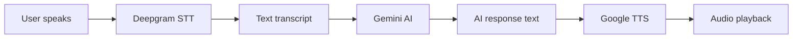
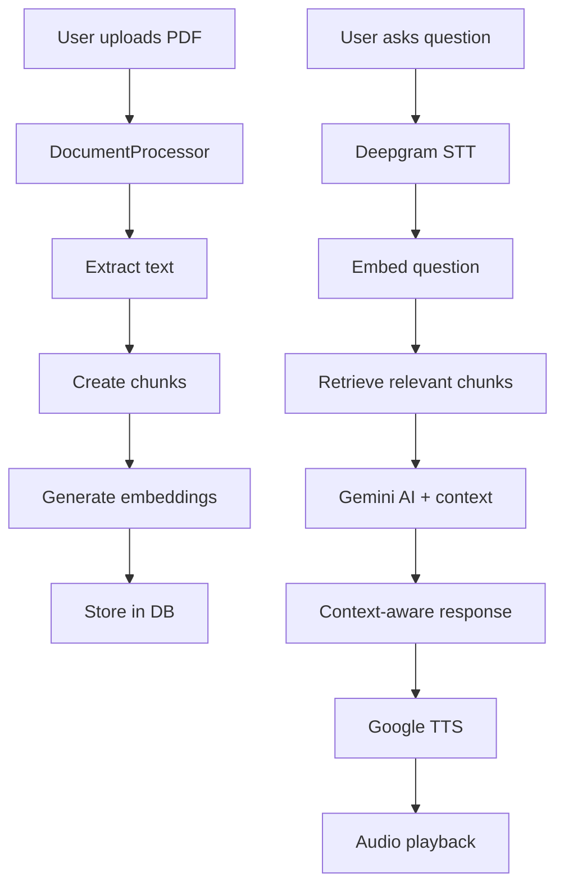

# XiAvSpeechAI - Technical Documentation

> **Last Updated:** November 29, 2025  
> **Version:** 1.0

---

## 📋 Table of Contents

1. [Project Overview](#project-overview)
2. [Backend Architecture](#backend-architecture)
3. [Frontend Architecture](#frontend-architecture)
4. [AI Services](#ai-services)
5. [API Reference](#api-reference)
6. [Database Schema](#database-schema)

---

## 🎯 Project Overview

**XiAvSpeechAI** is an AI-powered conversational learning platform that helps users improve their English communication skills through natural voice conversations, interview preparation, and vocabulary building.

### Technology Stack

**Backend:**

- Django 5.0.1 + Django REST Framework 3.14.0
- PostgreSQL 14+
- JWT Authentication (djangorestframework-simplejwt)

**Frontend:**

- Next.js 15.5.6 with React Compiler
- TypeScript
- Tailwind CSS

**AI Services:**

- Deepgram SDK 5.3.0 (Speech-to-Text)
- Google Cloud TTS 2.33.0 (Text-to-Speech)
- Google Gemini 2.0 Flash (Conversational AI)
- Gemini Text Embedding 004 (768-dim embeddings for RAG)

---

## 🏗️ Backend Architecture

### Directory Structure

```
backend/
├── apps/                          # Django apps (9 modules)
│   ├── accounts/                  # User authentication & profiles
│   ├── conversations/             # Conversation sessions & RAG
│   ├── learning/                  # Vocabulary builder
│   ├── interviews/                # Interview management
│   ├── evaluations/               # AI evaluations
│   ├── questions/                 # Question bank
│   ├── responses/                 # Video responses
│   ├── training/                  # Training sessions & scenarios
│   └── core/                      # Shared utilities
├── services/                      # AI & external services (7 files)
│   ├── deepgram_service.py       # Speech-to-Text
│   ├── google_tts_service.py     # Text-to-Speech
│   ├── gemini_service.py         # Conversational AI + RAG
│   ├── document_service.py       # Document processing & embeddings
│   ├── voice_config.py           # Voice configurations
│   ├── goal_tracker.py           # Progress tracking
│   └── __init__.py
├── config/                        # Django settings
│   ├── settings.py
│   └── urls.py                    # Main URL configuration
├── media/                         # Uploaded files (audio, documents, videos)
└── requirements.txt
```

---

## 📦 Backend Modules (Apps)

### 1. **accounts** - Authentication & User Management

**Models:**

- `CustomUser` - Extended Django user with language levels
- `LearnerProfile` - Extended profile with progress tracking

**Key Fields:**

- Language level (beginner/intermediate/advanced)
- Native & target language
- Preferred AI voice
- Total conversations & speaking time
- Current & longest streak
- Daily goals (minutes, conversations)
- Topics covered (JSON)

**API Endpoints:** 9 endpoints

- `POST /api/auth/register/` - User registration
- `POST /api/auth/login/` - Login (returns JWT tokens)
- `POST /api/auth/logout/` - Logout
- `POST /api/auth/token/refresh/` - Refresh access token
- `GET /api/auth/profile/` - Get user profile
- `PATCH /api/auth/profile/` - Update profile (supports nested `learner_profile` data)
- `POST /api/auth/change-password/` - Change password
- `GET /api/auth/profile/goal-status/` - Get daily goal progress
- `POST /api/auth/profile/set-goals/` - Set daily goals
- `GET /api/auth/profile/streak-history/` - Get streak history

---

### 2. **conversations** - Core Learning Engine

**Models:**

- `Topic` - Conversation topics with difficulty levels
- `ConversationSession` - Individual conversation instances
- `ConversationMessage` - User and AI messages
- `DocumentUpload` - Uploaded documents for RAG (max 5 per session)
- `DocumentChunk` - Text chunks with 768-dim embeddings

**Session Status:**

- `active` - Currently in progress
- `incomplete` - Saved for later
- `completed` - Finished

**API Endpoints:** ~20 endpoints (via ViewSet)

**Standard Endpoints:**

- `GET /api/conversations/topics/` - List topics
- `GET /api/conversations/sessions/` - List sessions
- `POST /api/conversations/sessions/` - Create session
- `GET /api/conversations/sessions/{id}/` - Get session details
- `PUT /api/conversations/sessions/{id}/` - Update session
- `DELETE /api/conversations/sessions/{id}/` - Delete session

**Custom Actions:**

- `POST /api/conversations/sessions/{id}/start_conversation/` - Start new conversation
- `GET /api/conversations/sessions/{id}/messages/` - Get messages
- `POST /api/conversations/sessions/{id}/speak/` - Send audio message
- `POST /api/conversations/sessions/{id}/end/` - End conversation
- `POST /api/conversations/sessions/{id}/mark_incomplete/` - Save for later
- `POST /api/conversations/sessions/{id}/upload_document/` - Upload PDF/TXT
- `GET /api/conversations/sessions/{id}/documents/` - List documents
- `DELETE /api/conversations/sessions/{id}/delete_document/{doc_id}/` - Delete document
- `GET /api/conversations/sessions/analytics/` - Get progress analytics

**Voice API:**

- `GET /api/conversations/voices/` - List available voices
- `GET /api/conversations/voices/{id}/` - Get voice details

---

### 3. **learning** - Vocabulary Builder

**Models:**

- `VocabularyItem` - Words users are learning

**Key Fields:**

- Word, definition, example sentence, translation
- Mastery level (1-5: New → Expert)
- Review count, times correct
- Source session (which conversation it came from)
- Last reviewed date

**API Endpoints:** ~6 endpoints (via ViewSet)

- `GET /api/learning/vocabulary/` - List vocabulary items
- `POST /api/learning/vocabulary/` - Add new word
- `GET /api/learning/vocabulary/{id}/` - Get word details
- `PUT /api/learning/vocabulary/{id}/` - Update word
- `DELETE /api/learning/vocabulary/{id}/` - Delete word
- `PATCH /api/learning/vocabulary/{id}/` - Partial update

---

### 4. **interviews** - Interview Management

**Models:**

- `Interview` - Interview sessions
- `InterviewQuestion` - Links interviews to questions

**Position Types:**

- Software Engineer, Data Scientist, Product Manager
- Designer, Marketing, Sales, General

**Interview Status:**

- `pending` → `in_progress` → `completed` → `evaluated`

**API Endpoints:** ~6 endpoints (via ViewSet)

- `GET /api/interviews/` - List interviews
- `POST /api/interviews/` - Create interview
- `GET /api/interviews/{id}/` - Get interview details
- `PUT /api/interviews/{id}/` - Update interview
- `DELETE /api/interviews/{id}/` - Delete interview
- `PATCH /api/interviews/{id}/` - Partial update

---

### 5. **evaluations** - AI Interview Evaluation

**Models:**

- `Evaluation` - Overall interview evaluation
- `QuestionEvaluation` - Per-question evaluation

**Scoring Dimensions:**

- Overall score (0-100)
- Communication, content, confidence, clarity scores
- Strengths & improvements (text)

**API Endpoints:** ~6 endpoints (via ViewSet)

- `GET /api/evaluations/` - List evaluations
- `POST /api/evaluations/` - Create evaluation
- `GET /api/evaluations/{id}/` - Get evaluation details
- `PUT /api/evaluations/{id}/` - Update evaluation
- `DELETE /api/evaluations/{id}/` - Delete evaluation
- `PATCH /api/evaluations/{id}/` - Partial update

---

### 6. **questions** - Question Bank

**Models:**

- `QuestionCategory` - Categories (Technical, Behavioral, etc.)
- `Question` - Interview questions

**Question Attributes:**

- Difficulty (easy, medium, hard)
- Position type
- Time limit (seconds)
- Audio file (TTS generated)
- Is active

**API Endpoints:** ~12 endpoints (2 ViewSets)

**Questions:**

- `GET /api/questions/` - List questions
- `POST /api/questions/` - Create question
- `GET /api/questions/{id}/` - Get question details
- `PUT /api/questions/{id}/` - Update question
- `DELETE /api/questions/{id}/` - Delete question
- `PATCH /api/questions/{id}/` - Partial update

**Categories:**

- `GET /api/questions/categories/` - List categories
- `POST /api/questions/categories/` - Create category
- `GET /api/questions/categories/{id}/` - Get category
- `PUT /api/questions/categories/{id}/` - Update category
- `DELETE /api/questions/categories/{id}/` - Delete category
- `PATCH /api/questions/categories/{id}/` - Partial update

---

### 7. **responses** - Video Responses

**Models:**

- `VideoResponse` - Video answers to interview questions
- `Transcript` - AI-generated transcripts

**Response Status:**

- `uploading` → `processing` → `completed` / `failed`

**API Endpoints:** ~6 endpoints (via ViewSet)

- `GET /api/responses/` - List responses
- `POST /api/responses/` - Upload video response
- `GET /api/responses/{id}/` - Get response details
- `PUT /api/responses/{id}/` - Update response
- `DELETE /api/responses/{id}/` - Delete response
- `PATCH /api/responses/{id}/` - Partial update

---

### 8. **training** - Practice & Scenarios

**Models:**

- `TrainingSession` - Practice sessions
- `TrainingFeedback` - Instant AI feedback
- `Scenario` - Structured roleplay scenarios

**Scenario Components:**

- Title, description, difficulty
- System prompt for AI
- Initial AI message
- Objectives (JSON array)
- Icon, is_active

**API Endpoints:** ~18 endpoints (3 ViewSets)

**Sessions:**

- `GET /api/training/sessions/` - List sessions
- `POST /api/training/sessions/` - Create session
- `GET /api/training/sessions/{id}/` - Get session
- `PUT /api/training/sessions/{id}/` - Update session
- `DELETE /api/training/sessions/{id}/` - Delete session
- `PATCH /api/training/sessions/{id}/` - Partial update

**Feedback:**

- `GET /api/training/feedback/` - List feedback
- `POST /api/training/feedback/` - Submit feedback
- `GET /api/training/feedback/{id}/` - Get feedback
- `PUT /api/training/feedback/{id}/` - Update feedback
- `DELETE /api/training/feedback/{id}/` - Delete feedback
- `PATCH /api/training/feedback/{id}/` - Partial update

**Scenarios:**

- `GET /api/training/scenarios/` - List scenarios
- `POST /api/training/scenarios/` - Create scenario
- `GET /api/training/scenarios/{id}/` - Get scenario
- `PUT /api/training/scenarios/{id}/` - Update scenario
- `DELETE /api/training/scenarios/{id}/` - Delete scenario
- `PATCH /api/training/scenarios/{id}/` - Partial update

---

### 9. **core** - Shared Utilities

Shared utilities and base classes used across apps.

---

## 📊 Backend API Summary

### Total API Endpoints: **~95+ endpoints**

| Module            | Endpoints | Type                     |
| ----------------- | --------- | ------------------------ |
| **accounts**      | 9         | Standard views           |
| **conversations** | ~20       | ViewSet + custom actions |
| **learning**      | ~6        | ViewSet                  |
| **interviews**    | ~6        | ViewSet                  |
| **evaluations**   | ~6        | ViewSet                  |
| **questions**     | ~12       | 2 ViewSets               |
| **responses**     | ~6        | ViewSet                  |
| **training**      | ~18       | 3 ViewSets               |
| **voices**        | ~6        | ViewSet                  |

**Note:** ViewSets automatically generate standard REST endpoints (list, create, retrieve, update, partial_update, destroy).

---

## 🎨 Frontend Architecture

### Directory Structure

```
frontend/
├── app/                           # Next.js App Router pages
│   ├── conversation/[id]/         # Conversation interface
│   │   └── page.tsx              # Main conversation page
│   ├── dashboard/                 # Main dashboard
│   │   └── page.tsx
│   ├── history/                   # Conversation history
│   │   └── page.tsx
│   ├── hr-login/                  # HR portal login
│   ├── login/                     # User login
│   │   └── page.tsx
│   ├── progress/                  # Progress tracking
│   │   └── page.tsx
│   ├── register/                  # User registration
│   │   └── page.tsx
│   ├── resume/                    # Resume incomplete sessions
│   │   └── page.tsx
│   ├── scenarios/                 # Roleplay scenarios
│   │   └── page.tsx
│   ├── settings/                  # User settings
│   │   └── page.tsx
│   ├── training/                  # Training center
│   │   ├── page.tsx              # Training list
│   │   └── [id]/                 # Individual training session
│   │       └── page.tsx
│   ├── vocabulary/                # Vocabulary builder
│   │   └── page.tsx
│   ├── layout.tsx                 # Root layout
│   ├── page.tsx                   # Landing page
│   └── globals.css                # Global styles
├── components/                    # Reusable React components
│   ├── AudioPlayer.tsx           # Audio playback component
│   ├── DocumentUpload.tsx        # Document upload for RAG
│   ├── GoalWidget.tsx            # Daily goals display
│   ├── Navbar.tsx                # Navigation bar
│   └── VoiceSelector.tsx         # AI voice selection
├── lib/                           # Utilities & helpers
│   ├── api.ts                    # API client (13.7KB)
│   ├── auth.tsx                  # Authentication context
│   └── utils.ts                  # Helper functions
├── types/                         # TypeScript type definitions
├── public/                        # Static assets
└── next.config.js                # Next.js configuration
```

### Frontend Pages (14 routes)

1. **`/`** - Landing page / Home
2. **`/login`** - User authentication
3. **`/register`** - New user signup
4. **`/dashboard`** - Main dashboard with stats
5. **`/conversation/[id]`** - Active conversation interface
6. **`/history`** - Past conversations
7. **`/progress`** - Progress tracking & analytics
8. **`/resume`** - Resume incomplete sessions
9. **`/vocabulary`** - Vocabulary builder
10. **`/training`** - Training center list
11. **`/training/[id]`** - Individual training session
12. **`/scenarios`** - Roleplay scenarios
13. **`/settings`** - User settings
14. **`/hr-login`** - HR portal access

### Key Components (5 components)

1. **`AudioPlayer.tsx`** - Plays AI audio responses
2. **`DocumentUpload.tsx`** - Upload PDFs/TXT for RAG
3. **`GoalWidget.tsx`** - Daily goal progress display
4. **`Navbar.tsx`** - Main navigation with authentication
5. **`VoiceSelector.tsx`** - AI voice preference selector

### Core Libraries (3 files)

1. **`api.ts`** - Centralized API client with all endpoints
2. **`auth.tsx`** - React Context for authentication state
3. **`utils.ts`** - Helper functions (formatting, validation, etc.)

---

## 🤖 AI Services

### Location: `backend/services/`

All AI and external service integrations are located in the `services/` directory.

### Service Files (7 files)

#### 1. **`gemini_service.py`** (15.2KB) - Conversational AI + RAG

**Purpose:** Core AI conversation engine with Retrieval Augmented Generation

**Key Features:**

- Google Gemini 2.0 Flash integration
- RAG (Retrieval Augmented Generation) support
- Context-aware responses using uploaded documents
- Conversation history management
- Prompt engineering for natural conversations

**Main Functions:**

```python
class GeminiService:
    def __init__(self, api_key: str)

    # Generate AI response with optional RAG context
    def generate_response(
        self,
        user_message: str,
        conversation_history: list,
        session_context: dict,
        document_chunks: list = None  # RAG chunks
    ) -> dict

    # Generate vocabulary suggestions
    def suggest_vocabulary(
        self,
        transcript: str,
        user_level: str
    ) -> list
```

**Prompt Features:**

- Slower-paced conversations (max 1 question per response)
- Warmer, more encouraging tone
- Active listening before questioning
- Difficulty adaptation based on user level
- RAG context integration when documents are uploaded

---

#### 2. **`document_service.py`** (12.1KB) - Document Processing & Embeddings

**Purpose:** Process uploaded documents and create vector embeddings for RAG

**Key Features:**

- PDF text extraction (PyPDF2 + pdfplumber)
- TXT file processing with encoding detection
- Text chunking with overlap
- Gemini text-embedding-004 (768-dimensional vectors)
- Cosine similarity search

**Main Functions:**

```python
class DocumentProcessor:
    def __init__(self, api_key: str)

    # Process uploaded document
    def process_document(
        self,
        file_path: str,
        file_type: str,
        session_id: int
    ) -> dict

    # Create text chunks with embeddings
    def create_chunks(
        self,
        text: str,
        document_id: int
    ) -> list

    # Retrieve relevant chunks for RAG
    def retrieve_chunks(
        self,
        query: str,
        session_id: int,
        top_k: int = 5
    ) -> list

    # Calculate cosine similarity
    def cosine_similarity(
        self,
        vec1: list,
        vec2: list
    ) -> float
```

**Configuration:**

- Chunk size: 800 tokens (~3200 chars)
- Chunk overlap: 100 tokens (~400 chars)
- Max documents per session: 5
- Max file size: 10MB
- Similarity threshold: 0.35

---

#### 3. **`deepgram_service.py`** (3.9KB) - Speech-to-Text

**Purpose:** Convert user audio to text transcripts

**Key Features:**

- Deepgram SDK 5.3.0 integration
- Real-time streaming transcription
- High accuracy English transcription
- Audio file support (WAV, MP3, WEBM, etc.)

**Main Functions:**

```python
class DeepgramService:
    def __init__(self, api_key: str)

    # Transcribe audio file to text
    def transcribe_audio(
        self,
        audio_file_path: str
    ) -> dict
```

**Response Format:**

```python
{
    "transcript": "user's spoken text",
    "confidence": 0.95,
    "words": [...],  # Word-level timestamps
    "duration": 5.2   # Audio duration in seconds
}
```

---

#### 4. **`google_tts_service.py`** (3.4KB) - Text-to-Speech

**Purpose:** Convert AI text responses to natural speech

**Key Features:**

- Google Cloud TTS integration
- Multiple voice options (4 voices)
- Natural-sounding speech synthesis
- MP3 audio output

**Main Functions:**

```python
class GoogleTTSService:
    def __init__(self, credentials_path: str)

    # Convert text to speech
    def synthesize_speech(
        self,
        text: str,
        voice_name: str = None
    ) -> bytes  # Audio data
```

**Available Voices:**

1. `en-US-Standard-F` - Light & Cheerful (Female)
2. `en-US-Standard-C` - Warm & Friendly (Female)
3. `en-US-Standard-D` - Professional (Male)
4. `en-US-Wavenet-A` - Calm & Soothing (Male)

---

#### 5. **`voice_config.py`** (2.9KB) - Voice Configuration

**Purpose:** Centralized voice configuration and settings

**Constants:**

```python
VOICE_CHOICES = [
    ('light_cheerful', 'Light & Cheerful'),
    ('warm_friendly', 'Warm & Friendly'),
    ('professional', 'Professional'),
    ('calm_soothing', 'Calm & Soothing'),
]

DEFAULT_VOICE = 'warm_friendly'

VOICE_MAPPING = {
    'light_cheerful': 'en-US-Standard-F',
    'warm_friendly': 'en-US-Standard-C',
    'professional': 'en-US-Standard-D',
    'calm_soothing': 'en-US-Wavenet-A',
}
```

---

#### 6. **`goal_tracker.py`** (5.2KB) - Progress Tracking

**Purpose:** Track user progress toward daily goals

**Key Features:**

- Daily conversation count tracking
- Speaking time tracking
- Streak calculation
- Goal achievement analytics

**Main Functions:**

```python
class GoalTracker:
    # Check daily goal status
    def get_daily_status(self, user_id: int) -> dict

    # Update progress after conversation
    def update_progress(
        self,
        user_id: int,
        speaking_time: int
    ) -> dict

    # Calculate streak
    def calculate_streak(
        self,
        user_id: int,
        date: datetime
    ) -> int
```

---

### AI Service Dependencies

```
google-generativeai==0.8.5      # Gemini AI & embeddings
deepgram-sdk==5.3.0             # Speech-to-Text
google-cloud-texttospeech==2.33.0  # Text-to-Speech
PyPDF2==3.0.1                   # PDF text extraction
pdfplumber==0.11.8              # Enhanced PDF parsing
numpy==1.26.4                   # Vector similarity calculations
charset-normalizer==3.4.0       # Text encoding detection
```

---

## 🔄 AI Workflow Examples

### 1. Standard Conversation Flow



### 2. RAG-Enhanced Conversation



---

## 📈 Database Schema Summary

### Total Models: 19 models across 9 apps

| App               | Models                                                                         |
| ----------------- | ------------------------------------------------------------------------------ |
| **accounts**      | CustomUser, LearnerProfile                                                     |
| **conversations** | Topic, ConversationSession, ConversationMessage, DocumentUpload, DocumentChunk |
| **learning**      | VocabularyItem                                                                 |
| **interviews**    | Interview, InterviewQuestion                                                   |
| **evaluations**   | Evaluation, QuestionEvaluation                                                 |
| **questions**     | QuestionCategory, Question                                                     |
| **responses**     | VideoResponse, Transcript                                                      |
| **training**      | TrainingSession, TrainingFeedback, Scenario                                    |

---

## 🔐 Authentication & Security

**Method:** JWT (JSON Web Tokens)

**Endpoints:**

- Login returns access token (15 min) + refresh token (1 day)
- All API endpoints require `Authorization: Bearer <token>`
- Refresh token used to get new access token

**Permissions:**

- All endpoints require authentication (`IsAuthenticated`)
- Users can only access their own data
- Admin panel requires staff/superuser status

---

## 🚀 Quick Reference

### Backend URL Patterns

```python
/admin/                          # Django admin panel
/api/auth/...                    # Authentication (9 endpoints)
/api/conversations/...           # Conversations + RAG (20+ endpoints)
/api/learning/...                # Vocabulary (6 endpoints)
/api/training/...                # Training & scenarios (18 endpoints)
/api/questions/...               # Question bank (12 endpoints)
```

### Frontend Route Patterns

```typescript
/                                # Landing page
/login, /register               # Authentication
/dashboard                      # Main dashboard
/conversation/[id]              # Active conversation
/history, /progress             # Analytics
/vocabulary                     # Vocabulary builder
/training, /training/[id]       # Practice center
/scenarios                      # Roleplay scenarios
/settings                       # User preferences
```

### Key Services

```python
# Import AI services
from services.gemini_service import GeminiService
from services.deepgram_service import DeepgramService
from services.google_tts_service import GoogleTTSService
from services.document_service import DocumentProcessor
from services.goal_tracker import GoalTracker
```

---

## 📝 Development Notes

### Environment Variables Required

```env
# Django
SECRET_KEY=...
DEBUG=True

# Database
DB_NAME=xiav_speech_ai
DB_USER=postgres
DB_PASSWORD=...

# AI Services
DEEPGRAM_API_KEY=...
GEMINI_API_KEY=...
GOOGLE_APPLICATION_CREDENTIALS=google-tts-key.json

# CORS
ALLOWED_HOSTS=localhost,127.0.0.1
CORS_ALLOWED_ORIGINS=http://localhost:3000
```

### Running the Application

**Backend:**

```bash
cd backend
python manage.py runserver
# Available at http://localhost:8000
```

**Frontend:**

```bash
cd frontend
npm run dev
# Available at http://localhost:3000
```

---

**End of Technical Documentation**
