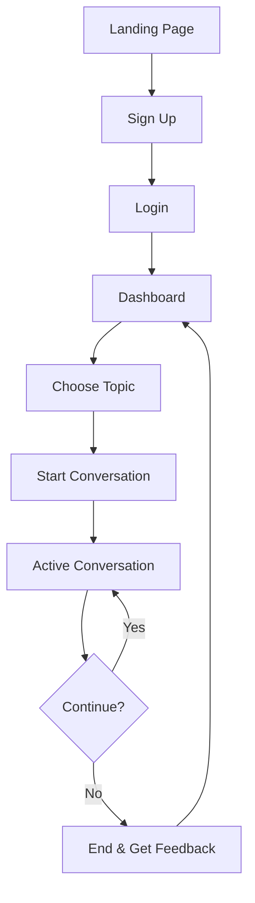
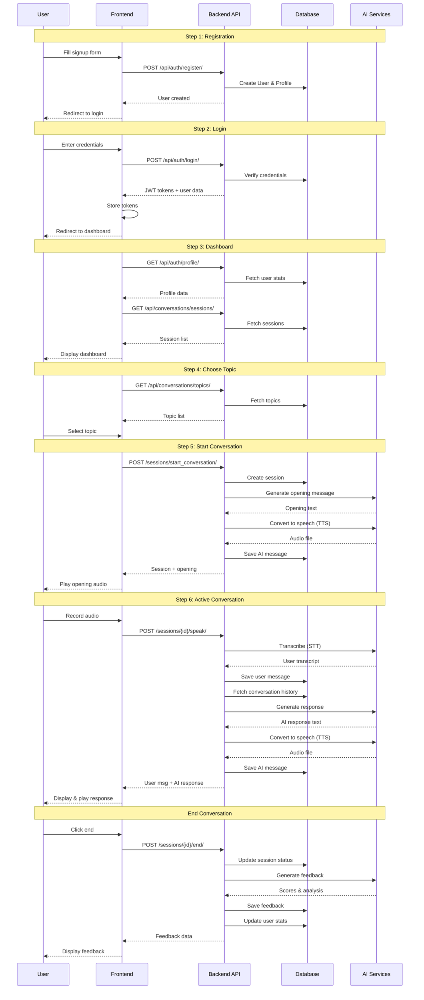

# User Workflow - XiAvSpeechAI

> Complete user journey from registration to active conversation

---

## 📋 Workflow Overview



---

## 🚀 Step-by-Step User Journey

### Step 1: User Signup

**Page:** `/register`

**User Actions:**
1. Visit the registration page
2. Fill out the form:
   - Username
   - Email
   - Password
   - Confirm Password
   - Language Level (Beginner/Intermediate/Advanced)
   - Native Language (default: English)
   - Target Language (default: English)

**API Call:**
```http
POST /api/auth/register/
Content-Type: application/json

{
  "username": "john_doe",
  "email": "john@example.com",
  "password": "SecurePass123!",
  "password2": "SecurePass123!",
  "language_level": "intermediate",
  "native_language": "Spanish",
  "target_language": "English"
}
```

**Backend Process:**
1. Validate user input (unique username/email, password strength)
2. Create `CustomUser` record
3. Auto-create `LearnerProfile` (via signals)
4. Return success response

**Response:**
```json
{
  "message": "User registered successfully",
  "user": {
    "id": 1,
    "username": "john_doe",
    "email": "john@example.com",
    "language_level": "intermediate"
  }
}
```

**Next:** Redirect to login page

---

### Step 2: Login

**Page:** `/login`

**User Actions:**
1. Enter credentials:
   - Username or Email
   - Password
2. Click "Login"

**API Call:**
```http
POST /api/auth/login/
Content-Type: application/json

{
  "username": "john_doe",
  "password": "SecurePass123!"
}
```

**Backend Process:**
1. Authenticate user credentials
2. Generate JWT access token (15 min expiry)
3. Generate JWT refresh token (1 day expiry)
4. Return tokens + user profile data

**Response:**
```json
{
  "access": "eyJhbGciOiJIUzI1NiIsInR5cCI6IkpXVCJ9...",
  "refresh": "eyJhbGciOiJIUzI1NiIsInR5cCI6IkpXVCJ9...",
  "user": {
    "id": 1,
    "username": "john_doe",
    "email": "john@example.com",
    "language_level": "intermediate",
    "learner_profile": {
      "total_conversations": 0,
      "total_speaking_time": 0,
      "current_streak": 0,
      "longest_streak": 0,
      "preferred_voice": "warm_friendly"
    }
  }
}
```

**Frontend Actions:**
1. Store tokens in localStorage/cookies
2. Store user data in React Context
3. Set Authorization header: `Bearer <access_token>`
4. Redirect to dashboard

**Next:** Navigate to `/dashboard`

---

### Step 3: Dashboard

**Page:** `/dashboard`

**User Actions:**
1. View personal statistics
2. Check daily goals progress
3. See conversation history
4. Review current streak

**API Calls:**

**3a. Get Profile & Stats**
```http
GET /api/auth/profile/
Authorization: Bearer <access_token>
```

**Response:**
```json
{
  "id": 1,
  "username": "john_doe",
  "language_level": "intermediate",
  "learner_profile": {
    "total_conversations": 15,
    "total_speaking_time": 3600,
    "current_streak": 7,
    "longest_streak": 12,
    "skill_scores": {
      "clarity": 78,
      "fluency": 82,
      "vocabulary": 75,
      "grammar": 80,
      "confidence": 85,
      "engagement": 88
    },
    "topics_covered": {
      "Casual Chat": 8,
      "Business Communication": 5,
      "Travel & Culture": 2
    }
  }
}
```

**3b. Get Recent Sessions**
```http
GET /api/conversations/sessions/?limit=5
Authorization: Bearer <access_token>
```

**Response:**
```json
{
  "count": 15,
  "results": [
    {
      "id": 15,
      "topic": {
        "id": 1,
        "name": "Casual Chat",
        "difficulty": "beginner"
      },
      "status": "completed",
      "started_at": "2025-11-29T10:30:00Z",
      "ended_at": "2025-11-29T10:45:00Z",
      "duration_seconds": 900,
      "message_count": 12
    }
  ]
}
```

**3c. Get Goal Status**
```http
GET /api/auth/profile/goal-status/
Authorization: Bearer <access_token>
```

**Response:**
```json
{
  "daily_goal_minutes": 10,
  "daily_goal_conversations": 1,
  "today_minutes": 8,
  "today_conversations": 1,
  "minutes_progress": 80,
  "conversations_progress": 100,
  "goals_met": false
}
```

**Dashboard Components:**
- Welcome message with streak 🔥
- Daily goals widget with progress bars
- Quick stats (total conversations, speaking time)
- Skill scores radar chart
- Topic distribution pie chart
- Recent sessions list
- "Start New Conversation" button (primary CTA)
- "Resume Incomplete Session" (if exists)

**Next:** Click "Start New Conversation" → Navigate to topic selection

---

### Step 3.5: Settings & Customization

**Page:** `/settings`

**User Actions:**
1. Navigate to Settings from Navbar
2. Update Profile Information (Name, Language Level)
3. **Select AI Voice Preference:**
   - Listen to voice previews
   - Select preferred voice (e.g., "Warm & Friendly", "Professional")
4. Click "Save Changes"

**API Call:**
```http
PATCH /api/auth/profile/
Authorization: Bearer <access_token>
Content-Type: application/json

{
  "first_name": "John",
  "last_name": "Doe",
  "language_level": "intermediate",
  "learner_profile": {
    "preferred_voice": "professional"
  }
}
```

**Backend Process:**
1. Validate user data
2. Update `CustomUser` fields
3. Update nested `LearnerProfile` fields (including `preferred_voice`)
4. Return updated user object

**Response:**
```json
{
  "id": 1,
  "username": "john_doe",
  "first_name": "John",
  "last_name": "Doe",
  "language_level": "intermediate",
  "learner_profile": {
    "preferred_voice": "professional",
    "total_conversations": 15
    // ... other profile fields
  }
}
```

**Next:** Return to Dashboard

---

### Step 4: Choose Topic

**Modal/Page:** Topic selection dialog on dashboard

**User Actions:**
1. Browse available topics
2. Filter by difficulty (optional)
3. Select a topic

**API Call:**
```http
GET /api/conversations/topics/
Authorization: Bearer <access_token>
```

**Response:**
```json
{
  "count": 5,
  "results": [
    {
      "id": 1,
      "name": "Casual Chat",
      "description": "Everyday conversations about life, hobbies, and interests",
      "difficulty": "beginner",
      "icon": "message-circle",
      "color": "blue",
      "conversation_count": 1250
    },
    {
      "id": 2,
      "name": "Business Communication",
      "description": "Professional discussions, meetings, and presentations",
      "difficulty": "intermediate",
      "icon": "briefcase",
      "color": "purple",
      "conversation_count": 890
    },
    {
      "id": 3,
      "name": "Academic Discussion",
      "description": "Intellectual conversations about science, history, and literature",
      "difficulty": "advanced",
      "icon": "book-open",
      "color": "green",
      "conversation_count": 450
    },
    {
      "id": 4,
      "name": "Travel & Culture",
      "description": "Conversations about travel experiences and cultural topics",
      "difficulty": "beginner",
      "icon": "plane",
      "color": "orange",
      "conversation_count": 680
    },
    {
      "id": 5,
      "name": "Current Events",
      "description": "Discuss news, trends, and current affairs",
      "difficulty": "intermediate",
      "icon": "newspaper",
      "color": "red",
      "conversation_count": 520
    }
  ]
}
```

**UI Display:**
- Topic cards with icons and colors
- Difficulty badge (Beginner/Intermediate/Advanced)
- Hover effects showing description
- Click to select topic

**User Selection:** User clicks on "Casual Chat" (ID: 1)

**Next:** Start conversation session

---

### Step 5: Start Conversation

**User Action:** After selecting topic, click "Start Conversation"

**API Call:**
```http
POST /api/conversations/sessions/start_conversation/
Authorization: Bearer <access_token>
Content-Type: application/json

{
  "topic_id": 1
}
```

**Backend Process:**
1. Create new `ConversationSession` record
2. Set status to "active"
3. Increment topic conversation count
4. Generate AI opening message using Gemini
5. Convert opening message to audio using Google TTS
6. Save AI message to database
7. Return session data with opening message

**Response:**
```json
{
  "session": {
    "id": 16,
    "topic": {
      "id": 1,
      "name": "Casual Chat",
      "difficulty": "beginner"
    },
    "status": "active",
    "started_at": "2025-11-29T15:00:00Z",
    "duration_seconds": 0,
    "message_count": 1
  },
  "opening_message": {
    "id": 101,
    "role": "ai",
    "text": "Hello! I'm so glad you're here today! How are you doing? What would you like to chat about?",
    "audio_url": "/media/audio/message_101.mp3",
    "audio_duration": 5,
    "timestamp": "2025-11-29T15:00:00Z"
  }
}
```

**Frontend Actions:**
1. Navigate to `/conversation/16`
2. Load conversation interface
3. Display AI opening message
4. Auto-play audio greeting
5. Show microphone button (ready to record)

---

### Step 6: Active Conversation

**Page:** `/conversation/16`

**Interface Components:**
- Message history display
- Audio visualization (waveform)
- Record button (microphone icon)
- VAD countdown timer
- Document upload button (RAG)
- End conversation button

---

#### 6.1: User Speaks (First Turn)

**User Actions:**
1. Click microphone button to start recording
2. Speak response (e.g., "I'm doing great! I'd like to talk about my weekend trip.")
3. Either:
   - Click stop button manually, OR
   - Wait for VAD auto-stop (4 seconds of silence)

**Frontend Process:**
1. Capture audio using Web Audio API
2. Show real-time audio level meter
3. Detect silence using VAD (15% threshold)
4. Show countdown timer when silence detected
5. Stop recording after 4 seconds of silence
6. Create audio blob (WebM/WAV format)

---

#### 6.2: Send Audio Message

**API Call:**
```http
POST /api/conversations/sessions/16/speak/
Authorization: Bearer <access_token>
Content-Type: multipart/form-data

{
  "audio": <audio_file.webm>,
  "duration": 8
}
```

**Backend Process:**
1. Save audio file to media storage
2. **Deepgram STT:** Transcribe audio to text
3. Create user message record (save transcript)
4. Retrieve uploaded documents (if any) for RAG
5. **Gemini AI:** Generate response considering:
   - User's message
   - Conversation history
   - User's language level
   - Topic context
   - Document context (RAG chunks if available)
6. **Google TTS:** Convert AI response to audio
7. Save AI message with audio
8. Return AI response

**Response:**
```json
{
  "user_message": {
    "id": 102,
    "role": "user",
    "text": "I'm doing great! I'd like to talk about my weekend trip.",
    "audio_url": "/media/audio/user_102.webm",
    "audio_duration": 8,
    "timestamp": "2025-11-29T15:00:15Z"
  },
  "ai_response": {
    "id": 103,
    "role": "ai",
    "text": "Oh, a weekend trip sounds exciting! I'd love to hear about it. Where did you go?",
    "audio_url": "/media/audio/ai_103.mp3",
    "audio_duration": 6,
    "timestamp": "2025-11-29T15:00:18Z"
  }
}
```

**Frontend Actions:**
1. Display user message in chat
2. Display AI response in chat
3. Auto-play AI audio response
4. Re-enable microphone button
5. Update message count

---

#### 6.3: Conversation Flow (Continued)

The conversation continues with the same pattern:

```
User → Record Audio → Send → STT → AI Processing → TTS → Response → User hears
```

**Example Conversation:**

| Turn | Role | Message |
|------|------|---------|
| 1 | AI | "Hello! I'm so glad you're here today! How are you doing?" |
| 2 | User | "I'm doing great! I'd like to talk about my weekend trip." |
| 3 | AI | "Oh, a weekend trip sounds exciting! Where did you go?" |
| 4 | User | "I went to the beach with my family." |
| 5 | AI | "That sounds wonderful! What activities did you do at the beach?" |
| 6 | User | "We went swimming and built sandcastles." |
| 7 | AI | "How lovely! Did the weather cooperate with your plans?" |
| ... | ... | ... |

---

#### 6.4: Document Upload (RAG - Optional)

**User Action:** Click "Upload Document" button

**API Call:**
```http
POST /api/conversations/sessions/16/upload_document/
Authorization: Bearer <access_token>
Content-Type: multipart/form-data

{
  "file": <document.pdf>
}
```

**Backend Process:**
1. Validate file (PDF/TXT, max 10MB)
2. Check document limit (max 5 per session)
3. Save file to media storage
4. **DocumentProcessor:**
   - Extract text from PDF/TXT
   - Split into chunks (800 tokens, 100 overlap)
   - Generate embeddings using Gemini
   - Store chunks in database
5. Mark document as processed

**Response:**
```json
{
  "id": 5,
  "filename": "travel_guide.pdf",
  "file_type": "pdf",
  "file_size": 2500000,
  "processed": true,
  "chunk_count": 12,
  "uploaded_at": "2025-11-29T15:05:00Z"
}
```

**RAG in Conversation:**
- AI retrieves relevant chunks using cosine similarity
- Top 5 chunks added to AI context
- AI references document content in responses

---

#### 6.5: View Messages

**User Action:** Scroll to view conversation history

**API Call:**
```http
GET /api/conversations/sessions/16/messages/
Authorization: Bearer <access_token>
```

**Response:**
```json
{
  "count": 14,
  "results": [
    {
      "id": 101,
      "role": "ai",
      "text": "Hello! I'm so glad you're here today!...",
      "audio_url": "/media/audio/message_101.mp3",
      "timestamp": "2025-11-29T15:00:00Z"
    },
    {
      "id": 102,
      "role": "user",
      "text": "I'm doing great! I'd like to talk about...",
      "audio_url": "/media/audio/user_102.webm",
      "timestamp": "2025-11-29T15:00:15Z"
    }
    // ... more messages
  ]
}
```

---

#### 6.6: End Conversation

**User Action:** Click "End Conversation" button

**API Call:**
```http
POST /api/conversations/sessions/16/end/
Authorization: Bearer <access_token>
```

**Backend Process:**
1. Mark session status as "completed"
2. Calculate duration (end_time - start_time)
3. Update learner profile:
   - Increment total_conversations
   - Add speaking_time
   - Update streak
   - Update topics_covered
4. **Gemini AI:** Generate comprehensive feedback
   - Analyze all messages
   - Score 6 dimensions (0-100)
   - Generate strengths & improvements
   - Suggest vocabulary words
5. Save feedback to database
6. Return feedback

**Response:**
```json
{
  "session": {
    "id": 16,
    "status": "completed",
    "duration_seconds": 900
  },
  "feedback": {
    "id": 10,
    "overall_score": 82,
    "clarity_score": 80,
    "fluency_score": 85,
    "vocabulary_score": 78,
    "grammar_score": 83,
    "confidence_score": 88,
    "engagement_score": 86,
    "strengths": "Great use of descriptive language. Your pronunciation was clear and easy to understand. You showed good engagement by asking follow-up questions.",
    "improvements": "Try to use more varied sentence structures. Practice using past perfect tense in storytelling. Work on reducing filler words like 'um' and 'uh'.",
    "vocabulary_suggestions": [
      {
        "word": "picturesque",
        "definition": "visually attractive, especially in a quaint or charming way",
        "example": "The beach was picturesque with its white sand and clear water."
      },
      {
        "word": "memorable",
        "definition": "worth remembering or easily remembered",
        "example": "It was a memorable weekend with my family."
      }
    ]
  }
}
```

**Frontend Actions:**
1. Navigate to feedback page
2. Display scores with visual charts
3. Show strengths and improvements
4. Display vocabulary suggestions with "Add to Vocabulary" buttons
5. Show "Back to Dashboard" button

---

## 📊 Complete Workflow Diagram



---

## 🔑 Key Technologies Per Step

| Step | Frontend | Backend | AI Service | Database |
|------|----------|---------|------------|----------|
| Signup | React Form | Django REST | - | PostgreSQL |
| Login | JWT Storage | djangorestframework-simplejwt | - | PostgreSQL |
| Dashboard | React Charts | Django ORM | - | PostgreSQL |
| Choose Topic | React Cards | Django ViewSet | - | PostgreSQL |
| Start Conv | Audio Player | Django + Gemini | Gemini 2.0 + Google TTS | PostgreSQL |
| Active Conv | Web Audio API | Django + AI Stack | Deepgram + Gemini + TTS | PostgreSQL |
| End Conv | React Charts | Django + Gemini | Gemini Analysis | PostgreSQL |

---

## 📝 User Experience Timeline

| Time | Action | Duration |
|------|--------|----------|
| 0:00 | Land on app | - |
| 0:30 | Sign up | 30s |
| 1:00 | Login | 30s |
| 1:10 | View dashboard | 10s |
| 1:30 | Browse topics | 20s |
| 1:40 | Select topic | 10s |
| 1:45 | AI greeting plays | 5s |
| 2:00 | User speaks first message | 15s |
| 2:05 | AI processes & responds | 5s |
| 2:10 | AI response plays | 5s |
| ... | Conversation continues | 10-15 min |
| 15:00 | End conversation | - |
| 15:05 | View feedback | 2-3 min |
| 18:00 | Return to dashboard | - |

**Total First Session:** ~18 minutes (signup to feedback)

---

**End of User Workflow Documentation**
